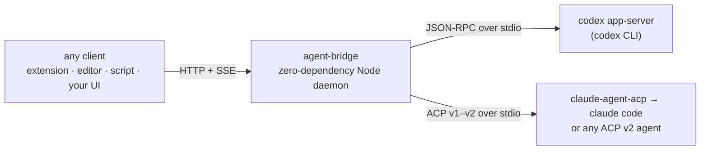
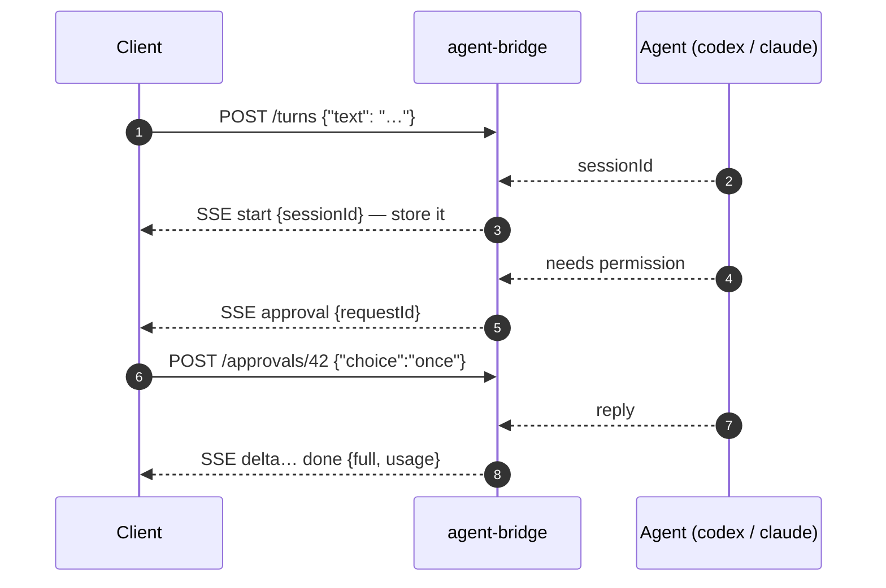

<p align="center">
  <strong>English</strong> · <a href="./README.zh-CN.md">简体中文</a>
</p>

<h1 align="center">agent-bridge</h1>

<p align="center">
  Run a CLI coding agent on your own machine. Talk to it from <em>any</em> client —<br/>
  a browser extension, an editor, a script, or your own UI. Your subscription is the backend — no model API keys required.
</p>

<p align="center">
  <a href="LICENSE"></a>&nbsp;
  <a href="https://github.com/xiaohuzai/agent-bridge/actions/workflows/ci.yml"></a>&nbsp;
  <a href="#development"></a>&nbsp;
  <a href="https://github.com/xiaohuzai/agent-bridge/issues"></a>
</p>



One small, versioned HTTP+SSE protocol (v1) in front; the agent keeps its own transcript, sessions and approvals behind it. Change one line of config to change the agent — client code never notices.

## Install

Node ≥ 18. Zero npm dependencies — a clone is enough:

```bash
git clone https://github.com/xiaohuzai/agent-bridge && cd agent-bridge
```

## Supported agents & prerequisites

| Agent | Install & log in first | Status |
|---|---|---|
| **codex** | `npm i -g @openai/codex`, then any ONE of: `codex login` (ChatGPT subscription) · `export OPENAI_API_KEY=…` · custom provider in `~/.codex/config.toml` | ✅ live-verified |
| **claude code** | `npm i -g @anthropic-ai/claude-code` → run `claude` once to log in · `npm i -g @agentclientprotocol/claude-agent-acp` (official ACP shim) | ✅ live-verified |
| any ACP v2 agent (gemini, opencode, kimi, …) | that agent's own CLI + login (gemini is native ACP: `gemini --experimental-acp`) | ❓ schema-level |

Per-agent details, behavior notes and troubleshooting: [docs/agents.md](./docs/agents.md).

## Configure

Every bridge — single or many — is an entry in one JSON config file; that is the only way to start the bridge. A working starter ships with the repo:

```bash
cp agents.example.json agents.json && chmod 600 agents.json
```

```json
{
  "bridges": [
    { "name": "codex",  "port": 3948, "apiKey": "", "sandbox": "workspace-write", "approval": "on-request" },
    { "name": "claude", "port": 3949, "apiKey": "" }
  ]
}
```

A single agent is the same thing with one entry — keep only the codex line, for example.

| Field | Meaning |
|---|---|
| `name` | must be a known agent — registry in [`agents-registry.mjs`](./agents-registry.mjs) (today: `codex`, `claude`) |
| `port` | required, unique per bridge |
| `apiKey` | `""` / omitted = keyless (loopback only); required when binding non-loopback |
| `command` | optional; overrides the default spawn — e.g. `["npx", "-y", "@agentclientprotocol/claude-agent-acp"]` |
| `cwd` | optional; default = the directory you start serve from (`~` and relative paths are resolved) |
| `sandbox` · `approval` · `network` · `codexBin` · `codexHome` · `corsOrigin` | optional, codex-specific tuning |

**Why a registry?** ACP implementations across the ecosystem vary widely — protocol versions, image/permission/streaming support; there is no framework everyone follows. A name enters the registry only after a real, live-verified turn through the bridge, so "supported" is a claim this repo stands behind, not a coin flip. New agent = verify a turn, add one line.

## Start

One command. It reads `./agents.json` by default:

```bash
node cli.mjs serve
# or: node cli.mjs serve --config /path/to/agents.json
```

Every bridge in the file starts and prints its address; Ctrl+C stops them all. Only two flags exist: `--config` (default `./agents.json`) and `--bind` (default `127.0.0.1`) — every other knob is a config-file field (see the table above).

## The API — four endpoints



| Endpoint | Body | Response |
|---|---|---|
| `GET /health` | — | `{ok:true, agent, version, proto:1}` |
| `GET /sessions` | — | `{ok:true, sessions:[{sessionId, busy}]}` |
| `POST /turns` | `{text, sessionId?, images?}` | SSE event stream |
| `POST /approvals/:requestId` | `{choice:'once'\|'always'\|'deny'}` | `{ok:true}` |

A minimal client is curl:

```bash
# alive? which agent?
curl http://127.0.0.1:3948/health

# a turn (-N disables curl buffering so you see the stream)
curl -N -X POST http://127.0.0.1:3948/turns -H 'Content-Type: application/json' \
  -d '{"text":"Run the test suite"}'
# data: {"type":"start","sessionId":"a1b2c3…"}      ← store it, pass it back next turn
# data: {"type":"delta","text":"…"}                 ← reply text, as it streams
# data: {"type":"tool","name":"command","detail":"npm test"}
# data: {"type":"done","full":"…","usage":{"prompt_tokens":N,"completion_tokens":M}}

# continue a conversation — same sessionId, never resend history
curl -N -X POST http://127.0.0.1:3948/turns -H 'Content-Type: application/json' \
  -d '{"text":"Fix the failing one","sessionId":"a1b2c3…"}'

# answer an approval while the turn stream is still open
curl -X POST http://127.0.0.1:3948/approvals/42 -H 'Content-Type: application/json' -d '{"choice":"once"}'

# recover the session list (e.g. after a client restart)
curl http://127.0.0.1:3948/sessions

# images are optional — https: or data: URLs, ≤8 per turn, 4MB body cap
curl -N -X POST http://127.0.0.1:3948/turns -H 'Content-Type: application/json' \
  -d '{"text":"What is in this image?","images":["https://example.com/pic.png"]}'
```

Rules worth knowing:

- `done` / `aborted` / `error` are the terminal events; `": ka"` lines are heartbeats — ignore them.
- **To cancel, hang up**: closing the `/turns` connection interrupts the agent — nothing keeps running headless.
- codex entries need `"approval": "on-request"` to emit `approval` events (ACP agents ask on their own); with the default `"never"`, commands either run inside the sandbox or are refused.
- The session id survives bridge restarts (the agent resumes from its own storage); session ids are agent-private — pointing a client at a different agent means starting a new conversation.

### Write your own client

```js
async function turn(text, sessionId) {
  const res = await fetch('http://127.0.0.1:3948/turns', {
    method: 'POST',
    headers: { 'Content-Type': 'application/json' },
    body: JSON.stringify({ text, sessionId }),
  });
  const reader = res.body.getReader();
  const decoder = new TextDecoder();
  let buf = '', full = '', sid = sessionId;
  for (;;) {
    const { value, done } = await reader.read();
    if (done) break;
    buf += decoder.decode(value, { stream: true });
    let i;
    while ((i = buf.indexOf('\n')) !== -1) {
      const line = buf.slice(0, i).trim();
      buf = buf.slice(i + 1);
      if (!line.startsWith('data:')) continue;
      const e = JSON.parse(line.slice(5));
      if (e.type === 'start') sid = e.sessionId;
      if (e.type === 'delta') full += e.text;
      if (e.type === 'done') { full = e.full || full; }
    }
  }
  return { text: full, sessionId: sid };
}
```

The authoritative contract — edge rules like first-turn session assignment and disconnect semantics — is the header comment of [`server.mjs`](./server.mjs).

## Run it on a remote server

Three steps:

```bash
# ① on the server — fill apiKey for EVERY entry in agents.json (required beyond
#    loopback; the CLI refuses keyless entries otherwise), then bind beyond loopback:
node cli.mjs serve --config agents.json --bind 0.0.0.0

# ② in your cloud console / firewall — open the port (the bridge cannot do this for you)

# ③ from your machine — connect with the key
curl http://SERVER_IP:3948/health -H 'Authorization: Bearer <key>'
```

Notes:

- The traffic is **plain HTTP** — fine inside a company network, VPN or tailnet; if the server is reachable from the public internet, terminate TLS in front (below) or keep the port firewalled to your own IP.
- The agent's credentials and workspace live on the server; the client is just a remote control.
- Boot persistence / crash restart is deliberately out of scope — wrap the one command in a systemd unit or launchd job.

<details>
<summary>TLS with a reverse proxy (public internet)</summary>

```caddy
# Caddyfile — auto-HTTPS + SSE-friendly proxying; the bridge stays on loopback
bridge.example.com {
    reverse_proxy 127.0.0.1:3948 {
        header_up Host 127.0.0.1:3948   # satisfy the loopback Host allowlist
        flush_interval -1               # stream SSE immediately
    }
}
```
(nginx works too: the bridge sends `X-Accel-Buffering: no`; keep proxy read timeouts ≥ 30 s — heartbeats fire every 15 s. No domain? Tailscale gives you one plus a certificate for free.)

</details>

## Known limitations (v1)

- Request body capped at 4MB; ≤8 images per turn.
- codex's `request_user_input` tool is declined by the bridge (the turn can proceed without it).
- A network-flake retry re-submits the whole prompt — the agent may run a turn twice.
- Turns are live-only: a client that disconnects cannot rejoin the same turn.
- The ACP adapter negotiates protocolVersion 1–2 (both official shims — codex-acp, claude-agent-acp — speak v1).

## Development

```bash
npm test   # real adapter + real HTTP server vs scripted fake agents — no installs, no network
```

## License

[MIT](./LICENSE)
