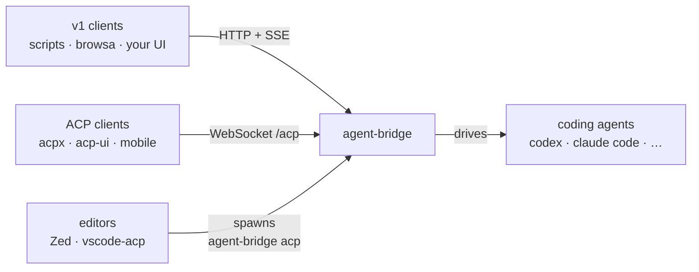
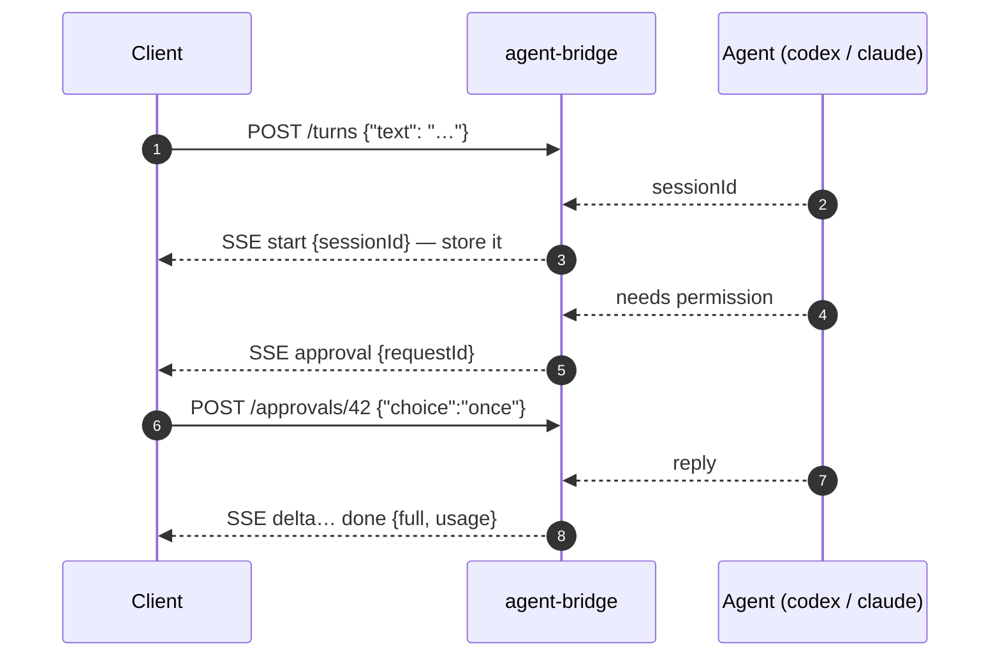

<p align="center">
  <strong>English</strong> · <a href="./README.zh-CN.md">简体中文</a>
</p>

<h1 align="center">agent-bridge</h1>

<p align="center">
  Run a CLI coding agent on your own machine. Talk to it from <em>any</em> client —<br/>
  a browser extension, an editor, a script, or your own UI. Your subscription is the backend — no model API keys required.
</p>

<p align="center">
  <a href="LICENSE"></a>&nbsp;
  <a href="https://github.com/xiaohuzai/agent-bridge/actions/workflows/ci.yml"></a>&nbsp;
  <a href="#development"></a>&nbsp;
  <a href="https://github.com/xiaohuzai/agent-bridge/issues"></a>
</p>

<p align="center">
  🌐 <a href="https://xiaohuzai.github.io/agent-bridge/en/">Website</a> · <a href="https://xiaohuzai.github.io/agent-bridge/en/configuration.html"><strong>Configuration reference</strong></a>
</p>


```mermaid
flowchart LR
    V["v1 clients<br/>scripts · browsa · your UI"] -->|"HTTP + SSE"| B["agent-bridge"]
    W["ACP clients<br/>acpx · acp-ui · mobile"] -->|"WebSocket /acp"| B
    E["editors<br/>Zed · vscode-acp"] -->|"spawns<br/>agent-bridge acp"| B
    B -->|drives| A["coding agents<br/>codex · claude code · …"]
```

One JSON config file turns your local coding agents into services — each entry with its own port, its own api key, its own sessions. Clients reach them through three doors: a built-in minimal HTTP API (v1), ACP over WebSocket, or a spawned ACP agent on stdio. Behind every door the agent keeps its own transcript, sessions and approvals; change one line of config to change the agent — client code never notices.

## Install

Node ≥ 18. Pick **one** of the two ways:

**npm (recommended)** — installs the `agent-bridge` command, which works in any directory:

```bash
npm i -g @xiaohuzai/agent-bridge
```

**From source** — clone the repo and use `node cli.mjs` wherever this README says `agent-bridge`:

```bash
git clone https://github.com/xiaohuzai/agent-bridge && cd agent-bridge
```

Just trying it out? `npx @xiaohuzai/agent-bridge serve` runs without installing.

## Supported agents & prerequisites

| Agent | Install & log in first | Status |
|---|---|---|
| **codex** | `npm i -g @openai/codex`, then any ONE of: `codex login` (ChatGPT subscription) · `export OPENAI_API_KEY=…` · custom provider in `~/.codex/config.toml` | ✅ live-verified |
| **claude code** | `npm i -g @anthropic-ai/claude-code` → run `claude` once to log in (the official `claude-agent-acp` shim ships bundled) | ✅ live-verified |
| **pi** | pi itself via its own installer (≥0.98, or `npm i -g @earendil-works/pi-coding-agent`) → run `pi` once to pick a provider (the `pi-acp` shim ships bundled; pi itself can't come from npm — its installer collides with the npm package) | ✅ live-verified |
| **gemini** | `npm i -g @google/gemini-cli` → run `gemini` once to log in (or env auth: `GEMINI_API_KEY`, or a custom gateway via `GOOGLE_GEMINI_BASE_URL`) | ✅ live-verified |
| **dsh** (DeepSeek Harness) | `npm i -g @openma/deepseek-harness-acp` (the openma ACP adapter — composes your installed dsh in-process, token-level streaming, sessions/credentials shared with the dsh desktop/Web UI); key via the dsh Web UI or `dsh-acp login` | ✅ live-verified (adapter 0.4.37 on dsh 0.2.0-rc.2) |
| **workbuddy** | WorkBuddy AI desktop app installed, logged in, and **running** (the adapter is a pure client of its local CodeBuddy worker gateway — port auto-discovered, `workbuddyPort` overrides) | ✅ live-verified |
| any ACP agent (opencode, kimi, qwen, …) | that agent's own CLI + login | ❓ schema-level |

The ACP **shims** (`claude-agent-acp`, `pi-acp`) ship as bundled optional dependencies — stateless glue, nothing to install for them; if you maintain your own shim install it wins, so the shim stays paired with the CLI version you actually run (the bundled copy is the zero-config fallback). The agent **CLIs** themselves stay YOUR installs, on purpose: they are versioned independently and stateful, and a pinned copy inside agent-bridge would fork the very CLI state (`~/.codex`, `~/.claude`) your terminal writes — the bridge spawns the same CLI you already use and log into. pi's runtime additionally cannot come from npm at all (installer collision, above). A bridge whose agent is missing still starts and answers `/health`; it fails on its first turn, with an install hint.

Per-agent details, behavior notes and troubleshooting: [docs/agents.md](./docs/agents.md).

## Configure

Every bridge — single or many — is an entry in one JSON config file; that is the only way to start the bridge. It must be named `agents.json` and live in the directory you start the bridge from. Pick **one** of the two ways:

**Copy the shipped starter.** `agents.example.json` ships with both installs, and running `agent-bridge serve` with no config prints the exact `cp` line for your machine:

```bash
# npm install (global)
cp "$(npm root -g)/@xiaohuzai/agent-bridge/agents.example.json" agents.json && chmod 600 agents.json

# source clone
cp agents.example.json agents.json && chmod 600 agents.json
```

On Windows, PowerShell runs both lines as-is; in `cmd`, use the path the CLI prints with `copy`.

**Or write it by hand** — this is the whole file:

```json
{
  "bridges": [
    { "name": "codex",  "port": 3948, "apiKey": "",
      "sandbox": "workspace-write", "approval": "on-request" },
    { "name": "claude", "port": 3949, "apiKey": "" },
    { "name": "pi",     "port": 3950, "apiKey": "" },
    { "name": "gemini", "port": 3951, "apiKey": "" }
  ]
}
```

The starter runs as-is — codex on 3948, claude on 3949, pi on 3950, gemini on 3951, no key needed on your own machine. A single agent is the same thing with one entry. `chmod 600` starts to matter once a real `apiKey` goes in the file.

**WorkBuddy AI desktop user?** Use its entry instead — the desktop app must be installed, logged in, and **running** (the adapter is a pure client of its local worker: the port is auto-discovered, `"workbuddyPort"` overrides, and `cwd` is the workspace the agent works in):

```json
{
  "bridges": [
    { "name": "workbuddy", "port": 3953, "apiKey": "", "cwd": "/path/to/your/project" }
  ]
}
```

**dsh (DeepSeek Harness) user?** Add its entry — the adapter ships bundled, no separate install (default command `dsh-acp`), and a DeepSeek key saved once is all it takes (dsh Web UI or `dsh-acp login`; the same credential store the desktop/Web UI uses); `cwd` is where sessions and file tools live, and sessions auto-register into the matching dsh workspace so the desktop/Web session list shows them:

```json
{
  "bridges": [
    { "name": "dsh", "port": 3952, "apiKey": "", "cwd": "/path/to/your/project" }
  ]
}
```

Route/model flags (`--model`, `--reasoning-effort`, `--permission-mode`) ride `args`; the verified key route needs no `args` at all — values and trade-offs in the dsh section of [docs/agents.md](./docs/agents.md).

| Field | Meaning |
|---|---|
| `name` | must be a known agent — registry in [`agents-registry.mjs`](./agents-registry.mjs) (today: `codex`, `claude`, `pi`, `gemini`, `dsh`, `workbuddy`, `zcode`) |
| `port` | required for serve, unique per bridge (may be omitted for entries used only via `acp`) |
| `apiKey` | `""` / omitted = keyless (loopback only); required when binding non-loopback |
| `command` | optional; overrides the default spawn — e.g. `["npx", "-y", "@agentclientprotocol/claude-agent-acp"]` |
| `args` | optional; extra argv **appended** to the agent's spawn command (ACP-spawned agents only) — e.g. dsh's model flag `["--model", "deepseek-v4-pro"]`; `~` is not expanded, use absolute paths |
| `cwd` | optional; omit it and the agent runs in the directory you start `serve` from (writing `"."` is the same thing); `~` and relative paths are resolved |
| `env` | optional `{VAR: value}` object merged over the daemon's environment for the spawned agent; entry env overrides any registry default |
| `acp` | optional; `true` opts this bridge into the ACP-over-WebSocket door (see Three ways to connect) |
| `sandbox` · `approval` · `network` · `codexBin` · `codexHome` · `corsOrigin` | optional, codex-specific tuning (values and trade-offs below) |
| `workbuddyPort` | optional; pins the WorkBuddy worker port when auto-discovery (a loopback listener scan for the worker's `/health` signature) comes up empty |

Type, default and **every allowed value** per field — plus the codex sandbox/approval trade-offs (the recipe for "too many approval cards") — live on the website's [configuration reference](https://xiaohuzai.github.io/agent-bridge/en/configuration.html).

**Why a registry?** ACP implementations across the ecosystem vary widely — protocol versions, image/permission/streaming support; there is no framework everyone follows. A name enters the registry only after a real, live-verified turn through the bridge, so "supported" is a claim this repo stands behind, not a coin flip. New agent = verify a turn, add one line.

## Start

One command. It reads `./agents.json` by default:

```bash
agent-bridge serve
# or: agent-bridge serve --config /path/to/agents.json
```

Every bridge in the file starts and prints its address; Ctrl+C stops them all. Serve has only two flags: `--config` (default `./agents.json`) and `--bind` (default `127.0.0.1`) — every other knob is a config-file field (see the table above). From a clone, use `node cli.mjs serve` — same flags.

Two other commands exist. `agent-bridge acp <entry>` (or `node cli.mjs acp <entry>` from a clone) spawns a single config entry as an ACP agent on stdio — see Three ways to connect below. And before your first chat (or after any config change), `agent-bridge doctor` pre-flights the whole setup:

```bash
agent-bridge doctor          # config validity · every agent binary on PATH · ports · apiKey rules
agent-bridge doctor --json   # machine-readable, for agent-driven setup flows
```

Every `FAIL` line carries its own fix, and the exit code is 1 iff something actually failed. A port already serving **this** bridge passes (the check doubles as the health probe of a running serve); a different bridge or a foreign process fails, with the port holder named.

## From zero to your first chat

New here? The whole journey is about five minutes:

1. **Install Node 18+** from [nodejs.org](https://nodejs.org) if you don't have it.
2. **Get agent-bridge**: `npm i -g @xiaohuzai/agent-bridge` — after this the `agent-bridge` command works in any directory. (Prefer source? Clone the repo and use `node cli.mjs` instead.)
3. **Create your config**: `agent-bridge` needs an `agents.json` in the directory you start it from. Run `agent-bridge serve` once — with no config it prints the exact copy command for your install — or write the JSON shown under [Configure](#configure). The config needs no edits — codex on port 3948, claude on 3949, pi on 3950, gemini on 3951, no password needed on your own machine (step 4 installs and logs in the agents themselves — the ACP shims ship bundled).
4. **Install & log in to every agent your config lists** — the starter enables four:
   - **codex** — `npm i -g @openai/codex`, then `codex login` once.
   - **claude** — `npm i -g @anthropic-ai/claude-code`, then run `claude` once to log in (the ACP shim it needs ships bundled).
   - **pi** — pi via its own installer, then run `pi` once to pick a provider (the `pi-acp` shim ships bundled).
   - **gemini** — `npm i -g @google/gemini-cli`, then run `gemini` once to log in.

   Only want one or two? Delete the other entries from `agents.json`. A bridge whose agent isn't installed still starts and answers `/health` — it only fails on its first turn, with an install hint — so a missing agent is easy to miss until you try it. `agent-bridge doctor` catches it before you try.
5. **Start the bridge**:

   ```bash
   agent-bridge serve
   ```

   You'll see:

   ```
   agent-bridge serve: 4 bridges on http://127.0.0.1
     codex      :3948  (no api key — loopback only)
     claude     :3949  (no api key — loopback only)
     pi         :3950  (no api key — loopback only)
     gemini     :3951  (no api key — loopback only)
   ```

6. **Connect browsa**: in browsa's settings, add a bridge provider and point it at `http://127.0.0.1:3948` — that's the codex line above. No key needed on your own machine.
7. **Chat.** Type in browsa; the reply streams back live. When the agent wants to run a command, browsa shows the approval — once / always / deny is your call.

Keep that terminal window open — closing it stops the agents. Want the other agents too? Add one bridge per agent in browsa, pointing at ports 3949–3951.

## Three ways to connect

|  | Built-in HTTP API (v1) | ACP over WebSocket | ACP over stdio |
|---|---|---|---|
| Who it's for | scripts and UIs that want the simplest thing | ACP clients over the network — acpx, acp-ui, mobile UIs | clients that launch agents as local commands — Zed, vscode-acp |
| How to enable | always on | `"acp": true` on the entry | `agent-bridge acp <entry>` |
| Address | `http://host:port` | `ws://host:port/acp` | launched by the client — no port |
| Lifecycle | resident daemon; sessions survive restarts | same — several clients share the bridge | follows the client; close = stop |
| Auth | Bearer apiKey (loopback may omit) | same apiKey on the WS handshake | none — a local spawn is the trust |

Notes:

- The ACP doors speak **ACP v1** — `initialize` → `session/new` → `session/prompt`; permission requests arrive as `session/request_permission` carrying the agent's own options. Same port and apiKey rules as v1 (the stdio door needs neither).
- A client's `session/new` cwd is ignored — the agent runs in the entry's `cwd`.
- The ACP doors cannot touch v1: opt-in config, separate paths, additive only.
- Design notes: [docs/design-acp-front.zh-CN.md](./docs/design-acp-front.zh-CN.md) (zh-CN).

### Plug in existing ACP clients

The ACP doors are what off-the-shelf ACP clients already speak — no agent-bridge-specific client code needed:

- **Network clients** (browser sidepanels — acp-sidepanel- and chrome-acp-style apps — plus acpx, acp-ui, your own UI): enable `"acp": true` on the entry and point the client at `ws://host:port/acp`, sending `Authorization: Bearer <apiKey>` (a keyless loopback bridge accepts connections without the header). A client proposing a newer `protocolVersion` in `initialize` is answered with the version we speak (1), not an error.
- **Editor clients** (Zed, vscode-acp) spawn the agent as a local command — point them at the bridge itself. With no `--config`, the registry's built-in default for the name is spawned, so this is zero-setup:

  ```json
  // Zed — settings.json → agent_servers
  {
    "agent_servers": {
      "agent-bridge": {
        "command": "agent-bridge",
        "args": ["acp", "claude"]
      }
    }
  }
  ```

  To configure the entry (sandbox, codex, a custom shim command), hand over a config: `["acp", "codex", "--config", "/abs/path/agents.json"]`.

## The built-in HTTP API (v1)

The minimal door — four endpoints and one SSE event vocabulary, deliberate and frozen. Clients that already speak ACP use the ACP doors above; everyone else starts here.


```mermaid
sequenceDiagram
    autonumber
    participant C as Client
    participant B as agent-bridge
    participant A as Agent (codex / claude)
    C->>B: POST /turns {"text": "…"}
    A-->>B: sessionId
    B-->>C: SSE start {sessionId} — store it
    A-->>B: needs permission
    B-->>C: SSE approval {requestId}
    C->>B: POST /approvals/42 {"choice":"once"}
    A-->>B: reply
    B-->>C: SSE delta… done {full, usage}
```

| Endpoint | Body | Response |
|---|---|---|
| `GET /health` | — | `{ok:true, agent, version, proto:1}` |
| `GET /sessions` | — | `{ok:true, sessions:[{sessionId, busy}]}` |
| `POST /turns` | `{text, sessionId?, images?}` | SSE event stream |
| `POST /approvals/:requestId` | `{choice:'once'\|'always'\|'deny'}` | `{ok:true}` |
| `POST /threads/:sessionId/title` | `{title}` | `{ok:true}` — name the agent-side thread for discovery in the agent's own UI (codex: `codex resume` accepts the name). `501` when the agent has no rename channel (claude names its own sessions). |

A minimal client is curl:

```bash
# alive? which agent?
curl http://127.0.0.1:3948/health

# a turn (-N disables curl buffering so you see the stream)
curl -N -X POST http://127.0.0.1:3948/turns -H 'Content-Type: application/json' \
  -d '{"text":"Run the test suite"}'
# data: {"type":"start","sessionId":"a1b2c3…"}      ← store it, pass it back next turn
# data: {"type":"delta","text":"…"}                 ← reply text, as it streams
# data: {"type":"tool","name":"command","detail":"npm test"}
# data: {"type":"done","full":"…","usage":{"prompt_tokens":N,"completion_tokens":M}}

# continue a conversation — same sessionId, never resend history
curl -N -X POST http://127.0.0.1:3948/turns -H 'Content-Type: application/json' \
  -d '{"text":"Fix the failing one","sessionId":"a1b2c3…"}'

# answer an approval while the turn stream is still open
curl -X POST http://127.0.0.1:3948/approvals/42 -H 'Content-Type: application/json' -d '{"choice":"once"}'

# recover the session list (e.g. after a client restart)
curl http://127.0.0.1:3948/sessions

# images are optional — https: or data: URLs, ≤8 per turn, 4MB body cap
curl -N -X POST http://127.0.0.1:3948/turns -H 'Content-Type: application/json' \
  -d '{"text":"What is in this image?","images":["https://example.com/pic.png"]}'
```

Rules worth knowing:

- `done` / `aborted` / `error` are the terminal events; `": ka"` lines are heartbeats — ignore them.
- **To cancel, hang up**: closing the `/turns` connection interrupts the agent — nothing keeps running headless.
- codex entries need `"approval": "on-request"` to emit `approval` events (ACP agents ask on their own); with the default `"never"`, commands either run inside the sandbox or are refused.
- The session id survives bridge restarts (the agent resumes from its own storage); session ids are agent-private — pointing a client at a different agent means starting a new conversation.

### Write your own client

```js
async function turn(text, sessionId) {
  const res = await fetch('http://127.0.0.1:3948/turns', {
    method: 'POST',
    headers: { 'Content-Type': 'application/json' },
    body: JSON.stringify({ text, sessionId }),
  });
  const reader = res.body.getReader();
  const decoder = new TextDecoder();
  let buf = '', full = '', sid = sessionId;
  for (;;) {
    const { value, done } = await reader.read();
    if (done) break;
    buf += decoder.decode(value, { stream: true });
    let i;
    while ((i = buf.indexOf('\n')) !== -1) {
      const line = buf.slice(0, i).trim();
      buf = buf.slice(i + 1);
      if (!line.startsWith('data:')) continue;
      const e = JSON.parse(line.slice(5));
      if (e.type === 'start') sid = e.sessionId;
      if (e.type === 'delta') full += e.text;
      if (e.type === 'done') { full = e.full || full; }
    }
  }
  return { text: full, sessionId: sid };
}
```

The authoritative contract — edge rules like first-turn session assignment and disconnect semantics — is the header comment of [`server.mjs`](./server.mjs).

## How is this different

- **Multi-agent by design.** One daemon, one config file, N agents — each on its own port with its own key. The first wave of "a web UI for one CLI" projects is gone (archived, sunset); what survived is multi-agent.
- **Approvals are first-class.** Permission requests stream to the client with the agent's own options, and the client decides once / always / deny. The best-known multi-agent HTTP bridge answers "always allow" server-side on the client's behalf — we think that's a bug, not a feature.
- **Live-verified adapters.** codex runs on its native app-server protocol; workbuddy on a native client of its desktop app's ACP-over-HTTP gateway; claude/pi/gemini through ACP against the official shims; dsh through its own official ACP automation profile. Every protocol fact was captured from real agents, not from docs.
- **Zero runtime dependencies.** One clone, one command. No installer, no container, no database — only the two stateless ACP shims ship as bundled optional dependencies; the agent CLIs stay yours.
- **ACP on both ends.** The bridge speaks ACP toward agents (stdio adapters) and toward clients (WebSocket / stdio fronts) — which is also what qualifies it for the ACP Registry (submission record: [docs/acp-registry.zh-CN.md](./docs/acp-registry.zh-CN.md); editors spawn it directly via `npx @xiaohuzai/agent-bridge acp claude`).

## Run it on a remote server

Three steps:

```bash
# ① on the server — fill apiKey for EVERY entry in agents.json (required beyond
#    loopback; the CLI refuses keyless entries otherwise), then bind beyond loopback:
agent-bridge serve --config agents.json --bind 0.0.0.0

# ② in your cloud console / firewall — open the port (the bridge cannot do this for you)

# ③ from your machine — connect with the key
curl http://SERVER_IP:3948/health -H 'Authorization: Bearer <key>'
```

Notes:

- The traffic is **plain HTTP** — fine inside a company network, VPN or tailnet; if the server is reachable from the public internet, terminate TLS in front (below) or keep the port firewalled to your own IP.
- The agent's credentials and workspace live on the server; the client is just a remote control.
- Boot persistence / crash restart is deliberately out of scope — wrap the one command in a systemd unit or launchd job.

<details>
<summary>TLS with a reverse proxy (public internet)</summary>

```caddy
# Caddyfile — auto-HTTPS + SSE-friendly proxying; the bridge stays on loopback
bridge.example.com {
    reverse_proxy 127.0.0.1:3948 {
        header_up Host 127.0.0.1:3948   # satisfy the loopback Host allowlist
        flush_interval -1               # stream SSE immediately
    }
}
```
(nginx works too: the bridge sends `X-Accel-Buffering: no`; keep proxy read timeouts ≥ 30 s — heartbeats fire every 15 s. No domain? Tailscale gives you one plus a certificate for free.)

</details>

## Known limitations

Everywhere:

- codex's `request_user_input` tool is declined by the bridge (the turn can proceed without it).
- A network-flake retry re-submits the whole prompt — the agent may run a turn twice.
- **workbuddy** keeps its gateway sessions in memory only: restarting the WorkBuddy desktop app resets every conversation's server-side context, and the next turn automatically continues in a fresh session (an in-stream note says so; your client's own history is unaffected). By ACP's client-owned session model, the desktop app's own UI does not list conversations started through the bridge.

Turns are live-only (all doors):

- A client that disconnects cannot rejoin the same turn; event streams are not resumable (the official ACP remote-transport RFD defers resumability too).
- Request bodies cap at 4MB; ≤8 images per turn.

Protocol notes:

- The ACP adapter negotiates protocolVersion 1–2 (the official shims — codex-acp, claude-agent-acp — and pi-acp all speak v1). Agents that only implement `session/load` for restore (pi-acp) are handled: `session/resume` is tried first, `session/load` is the automatic fallback.
- The ACP-over-WebSocket front follows the official remote-transport RFD, which is still Active (not final); when it lands we'll make a compliance pass.

## Development

```bash
npm test   # real adapter + real HTTP server vs scripted fake agents — no installs, no network
node --test test/agent-bridge-acp.test.mjs   # one file (never `node --test test/` — go through the npm glob)
```

Layout in one breath: [`server.mjs`](./server.mjs) is the v1 HTTP+SSE wire (its header comment is the authoritative, frozen contract) · `serve.mjs`/`cli.mjs` load the config and boot · [`adapters/`](./adapters/) speak toward agents (codex's native app-server, workbuddy's native HTTP client, a generic ACP-stdio adapter) · `acp-front*.mjs` + `wire-ws.mjs` are the opt-in ACP doors · `test/` holds the scripted fake agents.

Adding a long-tail agent is one line in [`agents-registry.mjs`](./agents-registry.mjs) (ACP agents just need a spawn command). One rule governs adapter work: protocol facts are captured live from real agents and recorded in the adapter's header comment — [AGENTS.md](./AGENTS.md) has the verification discipline, the traps already paid for, and the release flow.

## License

[MIT](./LICENSE)
