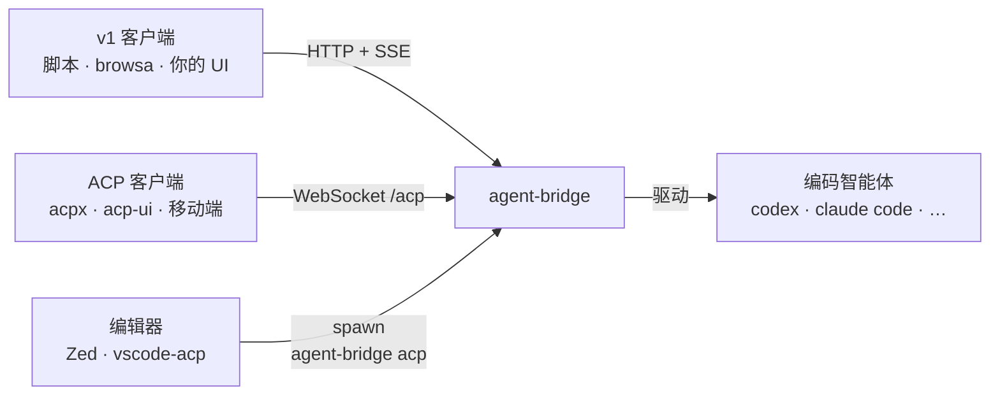
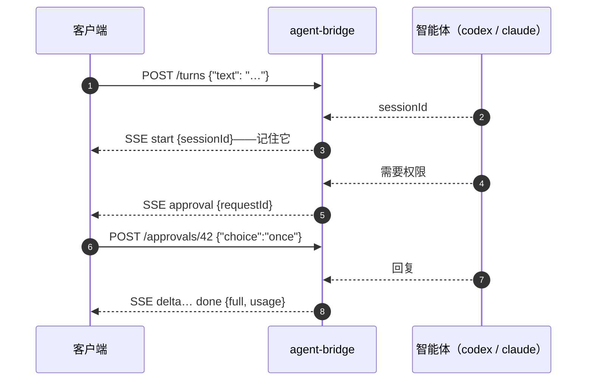

<p align="center">
  <a href="./README.md">English</a> · <strong>简体中文</strong>
</p>

<h1 align="center">agent-bridge</h1>

<p align="center">
  在自己的机器上跑 CLI 编码智能体，用<em>任何</em>客户端与它对话——<br/>
  浏览器扩展、编辑器、脚本、你自己的 UI 都行。你的订阅就是后端——不需要任何模型 API key。
</p>

<p align="center">
  <a href="LICENSE"></a>&nbsp;
  <a href="https://github.com/xiaohuzai/agent-bridge/actions/workflows/ci.yml"></a>&nbsp;
  <a href="#开发"></a>&nbsp;
  <a href="https://github.com/xiaohuzai/agent-bridge/issues"></a>
</p>



一份 JSON 配置，把你的本地编码智能体变成服务——每条配置一个端口、一把 apiKey、一套会话。客户端从三扇门进来：内置极简 HTTP API（v1）、WebSocket 上的 ACP、或 stdio 上被 spawn 的 ACP agent。每一扇门背后，智能体都自管对话记录、会话与审批；改一行配置就换一个智能体——客户端代码毫无感知。

## 安装

Node ≥ 18。两种方式**二选一**：

**npm 安装（推荐）**——装完之后，任意目录都能敲 `agent-bridge`：

```bash
npm i -g @xiaohuzai/agent-bridge
```

**源码运行**——clone 仓库，本 README 里所有 `agent-bridge` 命令都换成 `node cli.mjs`：

```bash
git clone https://github.com/xiaohuzai/agent-bridge && cd agent-bridge
```

只想先试试？`npx @xiaohuzai/agent-bridge serve` 免安装直跑。

## 支持的智能体与前置依赖

| 智能体 | 需要先装好并登录 | 状态 |
|---|---|---|
| **codex** | `npm i -g @openai/codex`，然后三选一：`codex login`（ChatGPT 订阅）· `export OPENAI_API_KEY=…` · `~/.codex/config.toml` 配自定义 provider | ✅ 实机验证 |
| **claude code** | `npm i -g @anthropic-ai/claude-code` → 跑一次 `claude` 完成登录 · `npm i -g @agentclientprotocol/claude-agent-acp`（官方 ACP 壳） | ✅ 实机验证 |
| **pi** | `npm i -g @earendil-works/pi-coding-agent pi-acp` → 配置 pi 的模型 provider（跑一次 `pi`，或 `~/.pi/agent/models.json`） | ✅ 实机验证 |
| 任何 ACP v2 智能体（gemini、opencode、kimi……） | 各自的 CLI + 登录（gemini 原生支持：`gemini --experimental-acp`） | ❓ 仅 schema 级 |

agent-bridge 不代装任何 agent——它零依赖，只负责启动你机器上已有的 CLI。某个 agent 没装时，对应的桥照样会启动、`/health` 也正常，只有第一次对话才失败（带安装提示）。

各 agent 的详细安装、行为注意事项与故障排查：[docs/agents.zh-CN.md](./docs/agents.zh-CN.md)。

## 配置

每个桥——单个还是多个——都是一份 JSON 配置里的一条；这是启动桥的唯一方式。文件名必须是 `agents.json`，放在你启动桥的目录下。**二选一**：

**复制起步配置。** `agents.example.json` 两种安装方式都自带；没有配置时直接跑一次 `agent-bridge serve`，它会打印出你机器上那条准确的 `cp` 命令：

```bash
# npm 安装（全局）
cp "$(npm root -g)/@xiaohuzai/agent-bridge/agents.example.json" agents.json && chmod 600 agents.json

# 源码 clone
cp agents.example.json agents.json && chmod 600 agents.json
```

Windows 上 PowerShell 可直接跑这两行；`cmd` 里用 CLI 打印出的路径配合 `copy`。

**或者手写**——整个文件就这么多：

```json
{
  "bridges": [
    { "name": "codex",  "port": 3948, "apiKey": "",
      "sandbox": "workspace-write", "approval": "on-request" },
    { "name": "claude", "port": 3949, "apiKey": "" }
  ]
}
```

起步配置开箱即跑——codex 在 3948、claude 在 3949，自己机器上不需要密码。单个智能体也一样，只是 `bridges` 里只有一条。等文件里填了真实的 `apiKey`，`chmod 600` 才开始有意义。

| 字段 | 说明 |
|---|---|
| `name` | 必须是注册表里的已知 agent——[`agents-registry.mjs`](./agents-registry.mjs)（当前：`codex`、`claude`、`pi`） |
| `port` | serve 必填，每桥唯一（仅用于 `acp` 的条目可省略） |
| `apiKey` | 留空/省略 = 无键（仅回环）；非回环绑定时必填 |
| `command` | 可选；覆盖默认启动命令——如 `["npx", "-y", "@agentclientprotocol/claude-agent-acp"]` |
| `cwd` | 可选；不写就跑在你启动 `serve` 的目录（写 `"."` 等价）；`~` 与相对路径会自动解析 |
| `acp` | 可选；`true` 时此桥启用 ACP-over-WebSocket 门（见「三扇门」） |
| `sandbox` · `approval` · `network` · `codexBin` · `codexHome` · `corsOrigin` | 可选，codex 相关调优 |

**为什么要有注册表？** ACP 生态各家的实现参差不齐——协议版本、图片/审批/流式支持各异，并没有一个大家都遵循的框架。一个名字要进入注册表，必须先过桥上的真实回合验证——所以「已支持」是本仓库背书的宣称，而不是碰运气。接入新 agent = 验证一个回合，加一行。

## 启动

只有一条命令，默认读 `./agents.json`：

```bash
agent-bridge serve
# 或：agent-bridge serve --config /path/to/agents.json
```

配置里的每个桥都会启动并打印自己的地址；Ctrl+C 全停。旗标只有两个：`--config`（默认 `./agents.json`）和 `--bind`（默认 `127.0.0.1`）——其余旋钮全是配置文件字段（见上表）。源码 clone 的用户用 `node cli.mjs serve`，旗标相同。

还有且仅有另一条命令：`agent-bridge acp <条目名>`（源码 clone 则为 `node cli.mjs acp <条目名>`）把单个配置条目变成 stdio 上的 ACP agent——见下方「三扇门」。

## 从零到第一句对话

第一次用？全程大约五分钟：

1. **装 Node 18+**（[nodejs.org](https://nodejs.org)），没有就先装。
2. **拿到 agent-bridge**：`npm i -g @xiaohuzai/agent-bridge`——之后任意目录敲 `agent-bridge` 都行。（喜欢源码？clone 仓库改用 `node cli.mjs`，效果一样。）
3. **建配置**：`agent-bridge` 需要在启动目录里有一个 `agents.json`。先跑一次 `agent-bridge serve`——没有配置时它会打印出你这次安装对应的复制命令——或者照[「配置」](#配置)一节手写那份 JSON。这份配置不用改——codex 在 3948、claude 在 3949，自己机器上不需要密码（agent 本身要在第 4 步装）。
4. **给你配置里的每个 agent 都装好并登录**——起步配置同时开了两个：
   - **codex**——`npm i -g @openai/codex`，然后 `codex login` 一次。
   - **claude**——`npm i -g @anthropic-ai/claude-code`，跑一次 `claude` 登录，再 `npm i -g @agentclientprotocol/claude-agent-acp`（桥真正启动的是这个 ACP 壳）。

   只想要一个？把 `agents.json` 里另一条删掉。agent 没装的桥照样会启动、`/health` 也正常——只有第一次对话才失败（带安装提示），所以在真正用它之前很容易被忽略。
5. **启动桥**：

   ```bash
   agent-bridge serve
   ```

   会看到：

   ```
   agent-bridge serve: 2 bridges on http://127.0.0.1
     codex       :3948  (no api key — loopback only)
     claude      :3949  (no api key — loopback only)
   ```

6. **连接 browsa**：在 browsa 的设置里添加一个 bridge provider，地址填 `http://127.0.0.1:3948`——就是上面 codex 那一行。自己机器上不需要 key。
7. **开聊。** 在 browsa 里输入，回复实时流式到达；agent 要执行命令时 browsa 会弹出审批——once / always / deny 你说了算。

那个终端窗口别关——关了 agent 就停了。想用 claude？在 browsa 里再加一个指向 3949 的桥就行。

## 三扇门

|  | 内置 HTTP API（v1） | WebSocket 上的 ACP | stdio 上的 ACP |
|---|---|---|---|
| 谁在用 | 想要最简的脚本和 UI | 走网络的 ACP 客户端——acpx、acp-ui、移动端 | 把 agent 当本地命令启动的客户端——Zed、vscode-acp |
| 怎么开 | 始终开启 | 条目写 `"acp": true` | `agent-bridge acp <条目名>` |
| 地址 | `http://host:port` | `ws://host:port/acp` | 由客户端启动——无端口 |
| 生命周期 | 常驻守护；会话跨重启存活 | 相同——多个客户端共享一座桥 | 跟随客户端；关 = 停 |
| 鉴权 | Bearer apiKey（回环可省） | WS 握手带同一把 apiKey | 无——本地 spawn 即信任 |

注意：

- 两扇 ACP 门说 **ACP v1**——`initialize` → `session/new` → `session/prompt`；权限请求以 `session/request_permission` 送达、带 agent 自己的选项。端口与 apiKey 规则与 v1 相同（stdio 门两者皆不需要）。
- 客户端 `session/new` 里的 cwd 会被忽略——agent 跑在条目配置的 `cwd`。
- ACP 门对 v1 零影响：opt-in 配置、独立路径、只增不改。
- 设计细节：[docs/design-acp-front.zh-CN.md](./docs/design-acp-front.zh-CN.md)。

### 插上现成的 ACP 客户端

ACP 门说的就是现成 ACP 客户端已经在说的话——客户端不需要写任何 agent-bridge 专用代码：

- **网络客户端**（浏览器侧边栏——acp-sidepanel、chrome-acp 这类——以及 acpx、acp-ui、你自己的 UI）：条目开 `"acp": true`，客户端指向 `ws://host:port/acp`，带上 `Authorization: Bearer <apiKey>`（无 key 的回环桥不需要鉴权头）。客户端 `initialize` 里提更新的 `protocolVersion` 会被应答为我们说的版本（1），不会报错。
- **编辑器客户端**（Zed、vscode-acp）把 agent 当本地命令启动——让它们启动桥本身。不带 `--config` 时用注册表内置默认命令启动该名字的 agent，零配置即用：

  ```json
  // Zed — settings.json → agent_servers
  {
    "agent_servers": {
      "agent-bridge": {
        "command": "agent-bridge",
        "args": ["acp", "claude"]
      }
    }
  }
  ```

  要配置条目（sandbox、codex、自定义 shim 命令），交给它一份配置：`["acp", "codex", "--config", "/abs/path/agents.json"]`。

## 内置 HTTP API（v1）

极简之门——四个端点、一套 SSE 事件词汇，刻意为之并已冻结。已经会说 ACP 的客户端请走上面的 ACP 门；其余所有人从这里开始。



| 端点 | 请求体 | 响应 |
|---|---|---|
| `GET /health` | — | `{ok:true, agent, version, proto:1}` |
| `GET /sessions` | — | `{ok:true, sessions:[{sessionId, busy}]}` |
| `POST /turns` | `{text, sessionId?, images?}` | SSE 事件流 |
| `POST /approvals/:requestId` | `{choice:'once'\|'always'\|'deny'}` | `{ok:true}` |

最小客户端就是 curl：

```bash
# 活着吗？背后是谁？
curl http://127.0.0.1:3948/health

# 发一个回合（-N 关掉 curl 缓冲，否则看不到流式）
curl -N -X POST http://127.0.0.1:3948/turns -H 'Content-Type: application/json' \
  -d '{"text":"跑一遍测试套件"}'
# data: {"type":"start","sessionId":"a1b2c3…"}      ← 记下它，下回合带回来
# data: {"type":"delta","text":"…"}                 ← 回复文本，流式到达
# data: {"type":"tool","name":"command","detail":"npm test"}
# data: {"type":"done","full":"…","usage":{"prompt_tokens":N,"completion_tokens":M}}

# 继续对话——同一个 sessionId，绝不重发历史
curl -N -X POST http://127.0.0.1:3948/turns -H 'Content-Type: application/json' \
  -d '{"text":"修一下挂掉的那个","sessionId":"a1b2c3…"}'

# 回答审批——趁回合的流还开着
curl -X POST http://127.0.0.1:3948/approvals/42 -H 'Content-Type: application/json' -d '{"choice":"once"}'

# 找回会话列表（比如客户端重启之后）
curl http://127.0.0.1:3948/sessions

# 图片可选——https: 或 data: URL，每回合 ≤8 张，请求体上限 4MB
curl -N -X POST http://127.0.0.1:3948/turns -H 'Content-Type: application/json' \
  -d '{"text":"这张图里是什么？","images":["https://example.com/pic.png"]}'
```

值得知道的规则：

- `done` / `aborted` / `error` 是终结事件；`": ka"` 行是心跳——忽略即可。
- **取消 = 挂断**：关掉 `/turns` 连接就是中断，agent 不会在后台继续跑。
- codex 条目要发 `approval` 事件需写 `"approval": "on-request"`（ACP 智能体自己决定何时问）；默认 `"never"` 时，命令要么在沙箱内执行、要么被拒。
- sessionId 能活过桥重启（agent 从自己的存储恢复）；sessionId 是 agent 私有的——客户端换了桥后面的 agent 就要新建对话。

### 自己写一个客户端

```js
async function turn(text, sessionId) {
  const res = await fetch('http://127.0.0.1:3948/turns', {
    method: 'POST',
    headers: { 'Content-Type': 'application/json' },
    body: JSON.stringify({ text, sessionId }),
  });
  const reader = res.body.getReader();
  const decoder = new TextDecoder();
  let buf = '', full = '', sid = sessionId;
  for (;;) {
    const { value, done } = await reader.read();
    if (done) break;
    buf += decoder.decode(value, { stream: true });
    let i;
    while ((i = buf.indexOf('\n')) !== -1) {
      const line = buf.slice(0, i).trim();
      buf = buf.slice(i + 1);
      if (!line.startsWith('data:')) continue;
      const e = JSON.parse(line.slice(5));
      if (e.type === 'start') sid = e.sessionId;
      if (e.type === 'delta') full += e.text;
      if (e.type === 'done') { full = e.full || full; }
    }
  }
  return { text: full, sessionId: sid };
}
```

权威契约——首回合会话分配、断连语义等边界规则——写在 [`server.mjs`](./server.mjs) 的头注释里。

## 有何不同

- **为多 agent 而生。** 一个守护进程、一份配置文件、N 个 agent——各自端口、各自 apiKey。第一代"单 CLI 配个网页 UI"的项目已经谢幕（归档的归档、弃养的弃养）；活下来的都是多 agent。
- **审批是一等公民。** 权限请求带着 agent 自己的选项流向客户端，由客户端决定 once / always / deny。知名度最高的多 agent HTTP 桥在服务端替客户端自动回答"总是允许"——我们认为那是 bug，不是 feature。
- **实机验证的适配器。** codex 走原生 app-server 协议，其余走 ACP 对接官方壳——每一条协议事实都来自真实 agent，不是文档。
- **零依赖。** 一次 clone，一条命令。没有安装器、没有容器、没有数据库。
- **两端都是 ACP。** 桥对 agent 说 ACP（stdio 适配器），对客户端也说 ACP（WebSocket / stdio 门）——这也是它有资格进入 ACP Registry 的原因（提交记录见 [docs/acp-registry.zh-CN.md](./docs/acp-registry.zh-CN.md)；编辑器里 `npx @xiaohuzai/agent-bridge acp claude` 即可拉起）。

## 部署到远程服务器

三步：

```bash
# ① 服务器上——agents.json 里每一条都填上 apiKey（出回环必填，否则 CLI 拒绝启动），
#    然后绑定到回环之外：
agent-bridge serve --config agents.json --bind 0.0.0.0

# ② 云控制台/防火墙——放行该端口（这步桥替你做不了）

# ③ 你本地——带着 key 连
curl http://服务器IP:3948/health -H 'Authorization: Bearer <key>'
```

注意事项：

- 流量是**明文 HTTP**——公司内网、VPN、tailnet 里用没问题；如果服务器暴露在公网，请在前面终结 TLS（见下）或把端口只放行给自己的 IP。
- 智能体的凭证和工作区都在服务器上，本地只是个遥控器。
- 开机自启/崩溃重启**有意不做**——用 systemd unit 或 launchd 包住那一条命令。

<details>
<summary>用反向代理上 TLS（公网场景）</summary>

```caddy
# Caddyfile —— 自动 HTTPS + 对 SSE 友好的转发；桥留在回环
bridge.example.com {
    reverse_proxy 127.0.0.1:3948 {
        header_up Host 127.0.0.1:3948   # 满足回环 Host 白名单
        flush_interval -1               # SSE 立即下发，不缓冲
    }
}
```
（nginx 同理：桥已发送 `X-Accel-Buffering: no`；代理读超时保持 ≥ 30 秒——桥每 15 秒发一次心跳。没有域名？Tailscale 免费送你一个域名加一张证书。）

</details>

## 已知边界

所有门共通：

- codex 的 `request_user_input` 工具会被桥拒绝（回合可继续）。
- 网络抖动触发的重试会重发整条 prompt——agent 侧可能把一个回合跑两遍。

回合只在线（所有门）：

- 断开的客户端无法重新接入同一个回合；事件流暂不支持续播（官方 ACP 远程传输 RFD 同样推迟了这一点）。
- 请求体上限 4MB；每回合 ≤8 张图。

协议说明：

- ACP adapter 协商 protocolVersion 1–2（官方壳 codex-acp、claude-agent-acp 与 pi-acp 都说 v1）。只实现 `session/load` 做 restore 的 agent（pi-acp）也能用：先试 `session/resume`，被拒自动回退 `session/load`。
- ACP-over-WebSocket 门遵循官方远程传输 RFD（状态 Active，尚未定稿）——规范落地后我们会做一次合规校准。

## 开发

```bash
npm test   # 真 adapter + 真 HTTP server，对打脚本化的假 agent——无需安装、无需联网
```

## 许可证

[MIT](./LICENSE)
