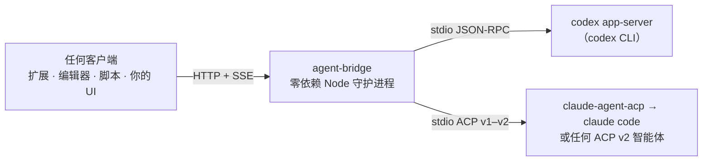
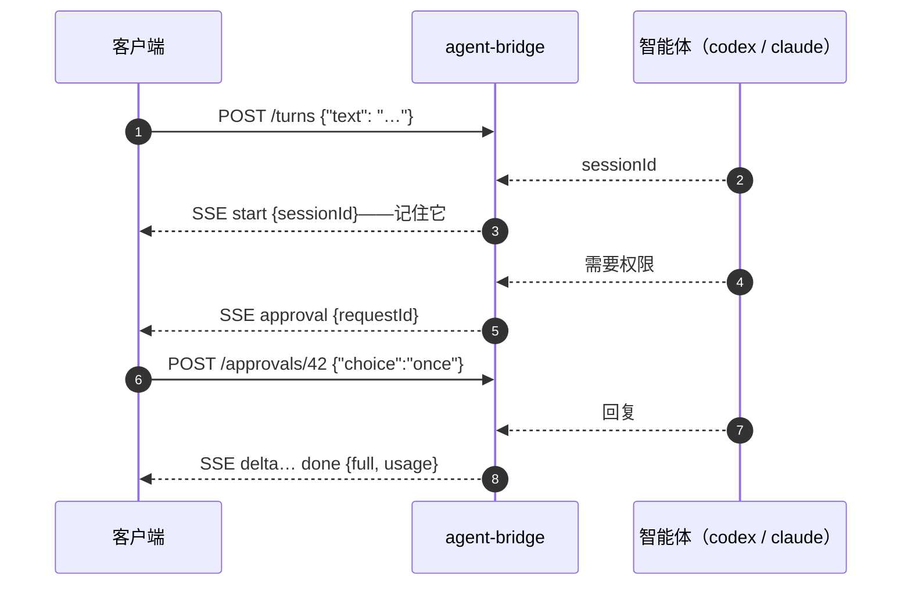

<p align="center">
  <a href="./README.md">English</a> · <strong>简体中文</strong>
</p>

<h1 align="center">agent-bridge</h1>

<p align="center">
  在自己的机器上跑 CLI 编码智能体，用<em>任何</em>客户端与它对话——<br/>
  浏览器扩展、编辑器、脚本、你自己的 UI 都行。你的订阅就是后端——不需要任何模型 API key。
</p>

<p align="center">
  <a href="LICENSE"></a>&nbsp;
  <a href="https://github.com/xiaohuzai/agent-bridge/actions/workflows/ci.yml"></a>&nbsp;
  <a href="#开发"></a>&nbsp;
  <a href="https://github.com/xiaohuzai/agent-bridge/issues"></a>
</p>



前面是一套小的、带版本的 HTTP+SSE 协议（v1）；智能体在后面自管对话记录、会话与审批。换一个启动命令就换一个智能体——客户端代码毫无感知。

## 安装

Node ≥ 18。零 npm 依赖——clone 下来就能跑：

```bash
git clone https://github.com/xiaohuzai/agent-bridge && cd agent-bridge
```

## 支持的智能体与前置依赖

| 智能体 | 需要先装好并登录 | 状态 |
|---|---|---|
| **codex** | `npm i -g @openai/codex`，然后三选一：`codex login`（ChatGPT 订阅）· `export OPENAI_API_KEY=…` · `~/.codex/config.toml` 配自定义 provider | ✅ 实机验证 |
| **claude code** | `npm i -g @anthropic-ai/claude-code` → 跑一次 `claude` 完成登录 · `npm i -g @agentclientprotocol/claude-agent-acp`（官方 ACP 壳） | ✅ 实机验证 |
| 任何 ACP v2 智能体（gemini、opencode、kimi……） | 各自的 CLI + 登录（gemini 原生支持：`gemini --experimental-acp`） | ❓ 仅 schema 级 |

各 agent 的详细安装、行为注意事项与故障排查：[docs/agents.zh-CN.md](./docs/agents.zh-CN.md)。

## 配置

单个智能体不需要配置文件——命令行旗标就够（下一节）。要在**一台机器上跑多个**，写一份 JSON 配置、一条命令全起。仓库自带可直接跑的起步配置：

```bash
cp agents.example.json agents.json && chmod 600 agents.json
```

```json
{
  "bridges": [
    { "name": "codex",  "port": 3948, "apiKey": "", "sandbox": "workspace-write", "approval": "on-request" },
    { "name": "claude", "port": 3949, "apiKey": "" }
  ]
}
```

| 字段 | 说明 |
|---|---|
| `name` | 必须是注册表里的已知 agent——[`agents-registry.mjs`](./agents-registry.mjs)（当前：`codex`、`claude`） |
| `port` | 必填，每桥唯一 |
| `apiKey` | 留空/省略 = 无键（仅回环）；非回环绑定时必填 |
| `command` | 可选；覆盖默认启动命令——如 `["npx", "-y", "@agentclientprotocol/claude-agent-acp"]` |
| `cwd` | 可选；默认 = 起 serve 的所在目录（`~` 与相对路径自动解析） |
| `sandbox` · `approval` · `network` · `codexBin` · `codexHome` · `corsOrigin` | 可选，codex 相关调优 |

## 启动

```bash
# ① 单个 codex
node cli.mjs codex --port 3948 --approval on-request
# ② 单个 claude code——`--` 后面可以换任何 ACP v2 智能体
node cli.mjs acp --port 3948 -- claude-agent-acp
# ③ 多个一起起，读配置文件
node cli.mjs serve --config agents.json
```

每个桥会打印自己的地址然后等待。常用旗标：`--port`（默认 3948）· `--cwd` · `--api-key`（别名 `--token`）· `--bind`（默认 127.0.0.1）· `--cors-origin loopback|*`——codex 专属：`--sandbox read-only|workspace-write|danger-full-access`、`--network`、`--approval never|on-request|untrusted`、`--codex-bin`、`--codex-home`。Ctrl+C 全部停止。

## 接口——四个端点



| 端点 | 请求体 | 响应 |
|---|---|---|
| `GET /health` | — | `{ok:true, agent, version, proto:1}` |
| `GET /sessions` | — | `{ok:true, sessions:[{sessionId, busy}]}` |
| `POST /turns` | `{text, sessionId?, images?}` | SSE 事件流 |
| `POST /approvals/:requestId` | `{choice:'once'\|'always'\|'deny'}` | `{ok:true}` |

最小客户端就是 curl：

```bash
# 活着吗？背后是谁？
curl http://127.0.0.1:3948/health

# 发一个回合（-N 关掉 curl 缓冲，否则看不到流式）
curl -N -X POST http://127.0.0.1:3948/turns -H 'Content-Type: application/json' \
  -d '{"text":"跑一遍测试套件"}'
# data: {"type":"start","sessionId":"a1b2c3…"}      ← 记下它，下回合带回来
# data: {"type":"delta","text":"…"}                 ← 回复文本，流式到达
# data: {"type":"tool","name":"command","detail":"npm test"}
# data: {"type":"done","full":"…","usage":{"prompt_tokens":N,"completion_tokens":M}}

# 继续对话——同一个 sessionId，绝不重发历史
curl -N -X POST http://127.0.0.1:3948/turns -H 'Content-Type: application/json' \
  -d '{"text":"修一下挂掉的那个","sessionId":"a1b2c3…"}'

# 回答审批——趁回合的流还开着
curl -X POST http://127.0.0.1:3948/approvals/42 -H 'Content-Type: application/json' -d '{"choice":"once"}'

# 找回会话列表（比如客户端重启之后）
curl http://127.0.0.1:3948/sessions

# 图片可选——https: 或 data: URL，每回合 ≤8 张，请求体上限 4MB
curl -N -X POST http://127.0.0.1:3948/turns -H 'Content-Type: application/json' \
  -d '{"text":"这张图里是什么？","images":["https://example.com/pic.png"]}'
```

值得知道的规则：

- `done` / `aborted` / `error` 是终结事件；`": ka"` 行是心跳——忽略即可。
- **取消 = 挂断**：关掉 `/turns` 连接就是中断，agent 不会在后台继续跑。
- codex 模式要发 `approval` 事件需带 `--approval on-request`（ACP 智能体自己决定何时问）；默认 `never` 时，命令要么在沙箱内执行、要么被拒。
- sessionId 能活过桥重启（agent 从自己的存储恢复）；sessionId 是 agent 私有的——客户端换了桥后面的 agent 就要新建对话。

### 自己写一个客户端

```js
async function turn(text, sessionId) {
  const res = await fetch('http://127.0.0.1:3948/turns', {
    method: 'POST',
    headers: { 'Content-Type': 'application/json' },
    body: JSON.stringify({ text, sessionId }),
  });
  const reader = res.body.getReader();
  const decoder = new TextDecoder();
  let buf = '', full = '', sid = sessionId;
  for (;;) {
    const { value, done } = await reader.read();
    if (done) break;
    buf += decoder.decode(value, { stream: true });
    let i;
    while ((i = buf.indexOf('\n')) !== -1) {
      const line = buf.slice(0, i).trim();
      buf = buf.slice(i + 1);
      if (!line.startsWith('data:')) continue;
      const e = JSON.parse(line.slice(5));
      if (e.type === 'start') sid = e.sessionId;
      if (e.type === 'delta') full += e.text;
      if (e.type === 'done') { full = e.full || full; }
    }
  }
  return { text: full, sessionId: sid };
}
```

权威契约——首回合会话分配、断连语义等边界规则——写在 [`server.mjs`](./server.mjs) 的头注释里。

## 部署到远程服务器

三步：

```bash
# ① 服务器上——绑定到回环之外（必须配 api key，否则 CLI 拒绝启动）
node cli.mjs codex --bind 0.0.0.0 --api-key $(openssl rand -hex 16) --approval on-request
#    或 serve 模式：agents.json 里每一条都填上 apiKey，然后：
node cli.mjs serve --config agents.json --bind 0.0.0.0

# ② 云控制台/防火墙——放行该端口（这步桥替你做不了）

# ③ 你本地——带着 key 连
curl http://服务器IP:3948/health -H 'Authorization: Bearer <key>'
```

注意事项：

- 流量是**明文 HTTP**——公司内网、VPN、tailnet 里用没问题；如果服务器暴露在公网，请在前面终结 TLS（见下）或把端口只放行给自己的 IP。
- 智能体的凭证和工作区都在服务器上，本地只是个遥控器。
- 开机自启/崩溃重启**有意不做**——用 systemd unit 或 launchd 包住那一条命令。

<details>
<summary>用反向代理上 TLS（公网场景）</summary>

```caddy
# Caddyfile —— 自动 HTTPS + 对 SSE 友好的转发；桥留在回环
bridge.example.com {
    reverse_proxy 127.0.0.1:3948 {
        header_up Host 127.0.0.1:3948   # 满足回环 Host 白名单
        flush_interval -1               # SSE 立即下发，不缓冲
    }
}
```
（nginx 同理：桥已发送 `X-Accel-Buffering: no`；代理读超时保持 ≥ 30 秒——桥每 15 秒发一次心跳。没有域名？Tailscale 免费送你一个域名加一张证书。）

</details>

## 已知边界（v1）

- 请求体上限 4MB；每回合 ≤8 张图。
- codex 的 `request_user_input` 工具会被桥拒绝（回合可继续）。
- 网络抖动触发的重试会重发整条 prompt——agent 侧可能把一个回合跑两遍。
- 回合只在线：断开的客户端无法重新接入同一个回合。
- ACP adapter 协商 protocolVersion 1–2（两个官方壳——codex-acp、claude-agent-acp——都说 v1）。

## 开发

```bash
npm test   # 真 adapter + 真 HTTP server，对打脚本化的假 agent——无需安装、无需联网
```

## 许可证

[MIT](./LICENSE)
